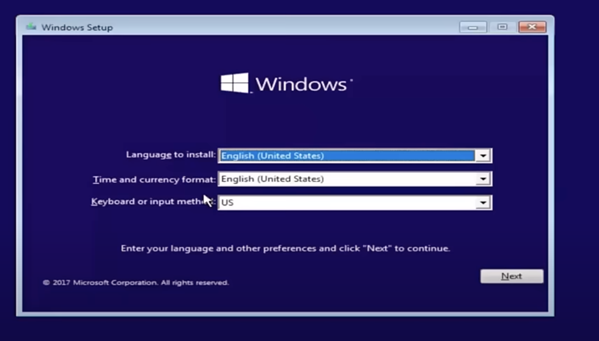
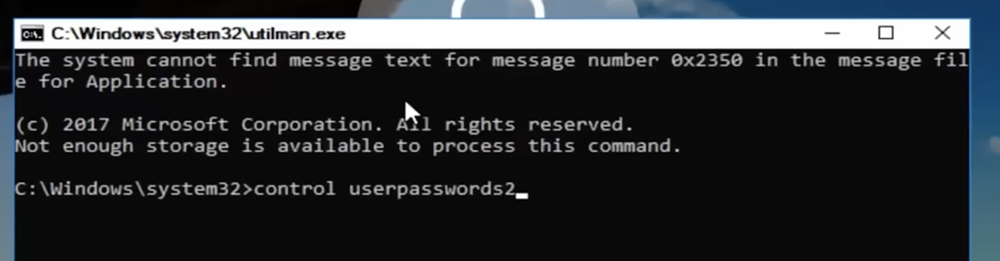

- # Easy Reset Windows user Login Password 

While you forgot your login passowrd, there have some easy methods to reset password.

1. Using Windows installation ISO.
- booting from ISO, while display setup , press "**shift F10**" , then will open command windows.



- Under the cmd window:
  - find the windows partition of your hard disk by diskpart.
  - cd c:\Windows\System32
  - copy Utilman.exe Utilman1.exe
  - copy cmd.exe cmd1.exe
  - Del Utilman.exe
  - rename cmd.exe Utilman.exe
  - Exit the windows, return Windows Setup screen.

- restart system and waiting user login screen.
- Click  button
- this will open command windows. 



running **control userpasswords2** , will open user manage windows where you can reset your password. after reset password, close command window. return to normal login screen.


Input your new password. you can login windows now.!!!

2. using windows PE 

- Get the files you need to create WinPE media
  - Download and install both the Windows ADK and the Windows PE Add-on. When you install the ADK choose, at minimum, the **Deployment Tools** feature.
    - https://learn.microsoft.com/en-us/windows-hardware/get-started/adk-install#download-the-adk-101261002454-december-2024
  - After you've downloaded and installed the ADK and Windows PE add-on, you can create bootable Windows PE media.

- Start the **Deployment and Imaging Tools Environment** as an administrator.

- Run **copype** to create a working copy of the Windows PE files.

  ```copype amd64 C:\WinPE_amd64```

- Use MakeWinPEMedia with the /UFD option to format and install Windows PE to the USB flash drive, specifying the USB key's drive letter:

​	```MakeWinPEMedia /UFD C:\WinPE_amd64 P:```

- booting with USB Windoes PE, after command line windows open. same as previous utilman.exe and cmd.exe copy/rename steps and others same step to reset password.

Ref:

https://learn.microsoft.com/en-us/windows-hardware/manufacture/desktop/winpe-create-usb-bootable-drive?view=windows-11

https://learn.microsoft.com/en-us/windows-hardware/get-started/adk-install

https://www.youtube.com/watch?v=P50PQwiYNec


